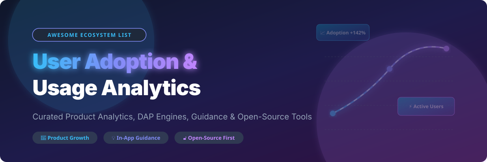

  

# 🚀 Awesome User Adoption & Usage Analytics 📊

> **A curated, SEO-optimized list of top commercial SaaS Digital Adoption Platforms (DAP), in-app onboarding tools, self-hosted product analytics engines, and open-source product tour libraries.** 🌟

---

## 📈 Market Overview & Dynamics

> 💡 **Estimated Market Size & Fragmentation:**  
> The global Digital Adoption Platform (DAP) and Product Analytics market is estimated at **$3.5B – $4.2B+** in 2026 and is projected to exceed **$8B+ by 2030**. The sector is **moderately fragmented**: enterprise DAP is consolidated among major players (SAP WalkMe, Whatfix, Gainsight), while self-serve product analytics and open-source alternatives (PostHog, Amplitude, Mixpanel, Matomo) drive intense competition across mid-market and developer-led segments.

---

## 📑 Table of Contents

- [🏢 SaaS / Hosted Platforms](#-saas--hosted-platforms)
- [🔓 Open-Source GitHub Projects](#-open-source-github-projects)
- [🏗️ Architectural Patterns: Combining Open-Source Tools](#️-architectural-patterns-combining-open-source-tools)
- [🤝 How to Contribute](#-how-to-contribute)
- [☕ Support & Sponsorship](#-support--sponsorship)
- [⭐ Star History](#-star-history)
- [⚠️ Disclaimer](#️-disclaimer)

---

## 🏢 SaaS / Hosted Platforms

| Product 🛠️ | Enterprise Size / Valuation / Revenue 💰 | Starting Paid Price 🏷️ | Free Tier / Trial Limit 🎁 | Key Focus & Best For 🎯 |
| :--- | :--- | :--- | :--- | :--- |
| **[Salesforce Lightning Usage App](https://www.salesforce.com/)** | **~$248B–$320B Market Cap** (~$35B+ Revenue) | Included with Salesforce subscription | Included natively with Salesforce org (No separate free plan needed) | Native usage analytics tracking Lightning Experience adoption and user activity inside Salesforce. |
| **[Pendo](https://www.pendo.io/)** | **$2.6B Valuation** (~$200M+ ARR) | Custom / ~$7,000/yr (Starter tier) | **Free forever up to 500 MAUs** (also offers 30-day full trial) | Combines product analytics, session replay, in-app guides, and NPS in one unified platform. |
| **[Amplitude](https://amplitude.com/)** | **~$1.55B Market Cap** (~$343M Revenue) | $0 (First 2M events free, then Plus tier scales with usage) | **Free forever up to 2 Million events/month** | Enterprise digital analytics platform with behavioral funnels, retention, and experimentation. |
| **[WalkMe](https://www.walkme.com/)** | **$1.5B Acquisition Value (by SAP)** (~$280M Revenue) | ~$1,200–$1,500/month (~$14,400/yr) | **No free plan** (Offers 30-day trial for WalkMe Learning Arc module only) | Enterprise pioneer in Digital Adoption Platforms (DAP) for employee & customer onboarding automation. |
| **[Mixpanel](https://mixpanel.com/)** | **$1.1B Valuation** (~$210M Revenue) | ~$28/month (Growth tier) | **Free forever up to 1 Million events/month** | Event-based product analytics platform specializing in interactive funnels and user retention cohorts. |
| **[Gainsight PX](https://www.gainsight.com/product-experience/)** | **$1.1B Acquisition Value (by Vista)** (~$200M Revenue) | Custom quote (Enterprise engagements start ~$30K/yr) | **No permanent free plan** (Offers a 30-day free trial) | Product experience platform combining product usage tracking with customer success workflows. |
| **[Whatfix](https://whatfix.com/)** | **$900M Valuation** (~$138M Revenue) | Custom quote (~$1,000–$1,200/month starting) | **No free plan / self-serve trial** (Provides scoped Proof-of-Concept on request) | Enterprise DAP with on-demand support widgets and strong integrations with Salesforce and ServiceNow. |
| **[Appcues](https://www.appcues.com/)** | **~$200M–$300M Valuation** (~$16.7M Revenue) | $249/month (Essentials tier, billed annually) | **No permanent free plan** (Offers a 14-day full feature free trial) | Product-led growth platform for non-technical teams to build no-code onboarding flows and tours. |
| **[Userpilot](https://userpilot.com/)** | **~$30M–$50M Valuation** (~$9.5M–$25M Revenue) | $249/month (Starter tier, billed annually) | **No permanent free plan** (Offers a 14-day free trial) | Product growth platform featuring onboarding checklists, feature adoption tracking, and in-app surveys. |

---

## 🔓 Open-Source GitHub Projects

*Sorted by GitHub Stars_Count in descending order.* 🌟

| Project 📦 | License 📜 | GitHub_Stars ⭐ | Description & Best For 💡 |
| :--- | :--- | :--- | :--- |
| **[PostHog](https://github.com/PostHog/posthog)** | MIT |  | **The all-in-one open-source product analytics suite**. Combines product analytics (events, funnels, retention), session replay, feature flags, A/B testing, surveys, and data warehouse in one stack. De facto open-source Amplitude alternative. |
| **[Umami](https://github.com/umami-software/umami)** | MIT |  | **Fast, privacy-focused web analytics**. Simple self-hosted solution collecting core usage statistics without cookies or invasive user tracking. |
| **[Plausible](https://github.com/plausible/analytics)** | AGPL-3.0 |  | **Lightweight and privacy-friendly web analytics**. Open-source Google Analytics alternative with lightweight script (<1KB) and clean dashboard UI. |
| **[Driver.js](https://github.com/kamranahmedse/driver.js)** | MIT |  | **Lightweight vanilla JavaScript product tour engine** (~3KB gzipped). Drives user focus across page elements for step-by-step feature onboarding and popover tours. |
| **[Intro.js](https://github.com/usablica/intro.js)** | AGPL-3.0 / Commercial |  | **Veteran step-by-step user onboarding and tour library**. Uses `data-intro` attributes to easily annotate elements for guided product tours. |
| **[Matomo](https://github.com/matomo-org/matomo)** | GPL-3.0 |  | **Comprehensive open-source web & product analytics platform** (formerly Piwik). Features session recording, heatmaps, A/B testing, and full GDPR privacy compliance. |
| **[Shepherd.js](https://github.com/shipshapecode/shepherd)** | MIT |  | **Framework-agnostic guided tour library**. Built with Floating UI for smooth popover positioning across React, Vue, Angular, and Ember apps. |
| **[OpenReplay](https://github.com/openreplay/openreplay)** | AGPL-3.0 |  | **Self-hosted session replay and UX debugging platform**. Replays user sessions alongside network logs, console errors, and state changes. Open-source LogRocket alternative. |
| **[React Joyride](https://github.com/gilbarbara/react-joyride)** | MIT |  | **Popular React guided tour component**. Create customizable walkthroughs and guided tours for React web applications. |
| **[Countly](https://github.com/Countly/countly-server)** | GPL-3.0 |  | **Product analytics for mobile, web, and desktop apps**. Tracks active users, retention, push notifications, and crash reports. |
| **[Jitsu](https://github.com/jitsucom/jitsu)** | MIT |  | **Open-source event data collection platform**. Streams analytics events to data warehouses (ClickHouse, Snowflake, Postgres) and APIs. Segment alternative. |
| **[Reactour](https://github.com/elrumordelaluz/reactour)** | MIT |  | **Flexible React tour library**. Provides customizable tooltips and spotlight overlays to walk users through React interfaces. |
| **[Tour Kit](https://github.com/domidex01/tour-kit)** | BSL-1.1 / MIT Core |  | **Headless product tours and onboarding framework for React**. Composable packages supporting custom UI components, checklists, and accessibility. |

---

## 🏗️ Architectural Patterns: Combining Open-Source Tools

For engineering and product teams building self-hosted user adoption and analytics stacks, common open-source component combinations include:

* 📊 **Product Analytics + Session Replay**: Deploy **PostHog** for full-stack event tracking, session replay, and feature flagging, or pair **Matomo** / **Plausible** (analytics) with **OpenReplay** (session recording).
* 💡 **In-App Guidance & Product Tours**: Use **Driver.js** or **Shepherd.js** for lightweight popover tours, or **React Joyride** / **Reactour** for React-native user flows.
* 🔄 **Data Pipeline**: Stream event telemetry via **Jitsu** into ClickHouse or PostgreSQL for custom adoption dashboards.

---

## 🤝 How to Contribute

1. Fork the repo.
2. Add/edit entries in `README.md` (follow existing tabular structure).
3. Include: name, link, 1–2 sentence description, license, and relevant metrics.
4. Submit PR with a short explanation.

⭐ Star the repo if you find it useful!

---

## ☕ Support & Sponsorship

Thank you for exploring this curated ecosystem list! If you found this list helpful for evaluating user adoption, product analytics, or Digital Adoption Platforms, please consider supporting the project:

- ⭐ **Star this repository** to help others discover it!
- 🔀 **Fork & Share** it with product managers, developers, and UX teams.
- ☕ **Buy me a coffee / Sponsor** the maintainer to support ongoing curation and open-source research:  
  

---

## 🌟 Star History

---

## ⚠️ Disclaimer

- This is a **community-curated** list — not exhaustive and not an official endorsement.
- User adoption platforms handle sensitive user behavior data and may process PII. Self-hosted solutions require proper security hardening, access controls, and compliance with data privacy regulations (GDPR, CCPA).
- **Session replay raises privacy concerns** — ensure proper consent, mask sensitive data, and comply with privacy regulations. PostHog and OpenReplay provide automatic masking options.
- **License considerations**: PostHog uses MIT, Matomo uses GPL-3.0, Plausible uses AGPL-3.0, Umami uses MIT, Shepherd uses MIT, and Intro.js uses AGPL-3.0 with commercial options. Verify licensing against your organization's legal policies before deploying.

---

  <b>Made with ❤️ for product managers, UX teams, and organizations seeking user adoption analytics sovereignty.</b> 
  <i>Let's make user adoption and usage analytics more open, transparent, and user-centric.</i>

